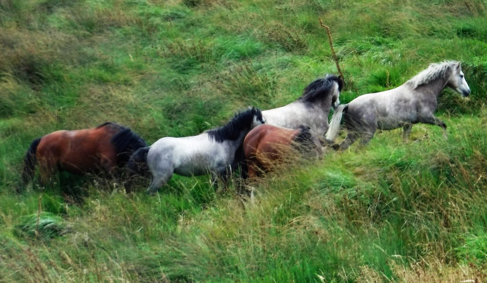
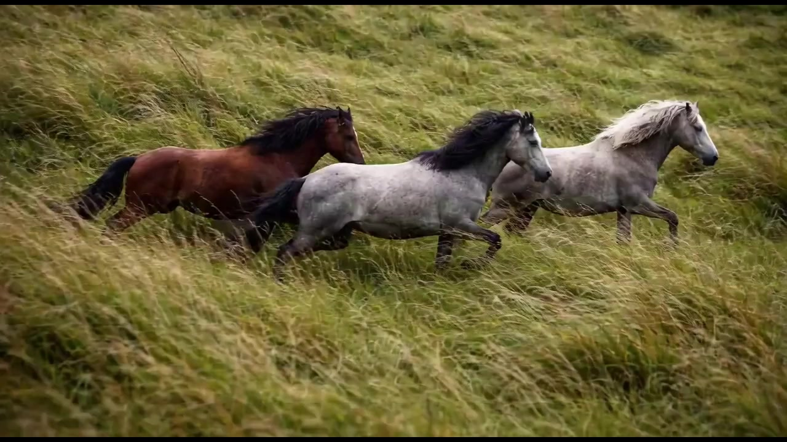

# Proyecto de Caballos - Flujo de Trabajo de Imagen a Video

Un proyecto de imagen a video basado en ComfyUI que presenta ponis galeses de montaña, creado usando imágenes generadas por IA y síntesis de video.

## Resumen del Proyecto

Este proyecto consiste en **26 escenas**, cada una de **5 segundos de duración**, generadas usando flujos de trabajo de ComfyUI. Cada escena fue creada usando un archivo de flujo de trabajo dedicado, resultando en una narrativa de video cohesiva sobre ponis galeses de montaña.

Todas las imágenes de las escenas fueron generadas consistentemente a partir de una única imagen base: **Welsh-mountain-ponies** (`Welsh-mountain-ponies-1024x598.jpg`). Esta imagen base sirvió como fundamento para generar las 26 imágenes específicas de cada escena, asegurando consistencia visual a lo largo del proyecto.

### Imagen Base

## Video Final

**Haz clic en la imagen de abajo para ver el video en Vimeo** (se abre en una nueva pestaña):

**Enlace directo**: [https://vimeo.com/1155850891](https://vimeo.com/1155850891)

## Detalles Técnicos

### Software
- **ComfyUI**: Generación de imagen a video
- **ChatGPT**: Generación de imágenes a partir de la imagen base de ponis galeses de montaña
- **OpenShot Video Editor**: Fusión de escenas y ensamblaje final del video (sin edición adicional)

### Hardware
- **GPU**: NVIDIA RTX 5060 Ti con 16GB DDR7
- **RAM**: 64GB DRAM
- **OS**: Linux / Ubuntu

## Estructura del Proyecto

- **Flujos de Trabajo**: 26 archivos JSON de flujo de trabajo (LTX-2 I2V WORKFLOW Part 01.json hasta Part 26.json)
- **Imagen Base**: `Welsh-mountain-ponies-1024x598.jpg` - La imagen original usada para generar las 26 imágenes de escenas
- **Imágenes**: Imagen base e imágenes de escenas generadas almacenadas en `assets/images/`
- Cada archivo de flujo de trabajo corresponde a una escena en el video final

## Estructura Narrativa

El proyecto está organizado en cuatro arcos narrativos:

### Arco 1 (Escenas 1–6): Movimiento y Descubrimiento
Rápido → aéreo → silueta → reagrupación

### Arco 2 (Escenas 7–12): Detalle e Intimidad
Primeros planos, cascos, aliento, crines, hierba

### Arco 3 (Escenas 13–20): Clima y Cambio
Niebla, lluvia, luz cambiante, aumento del viento

### Arco 4 (Escenas 21–26): Resolución
Escenas finales que llevan la narrativa a su conclusión

## Audio

**Pista de Audio**: Nature Documentary Time Lapse  
**Fuente**: [AudioJungle](https://audiojungle.net/item/nature-documentary-time-lapse/28903445)  
**Licencia**: Licencia comprada de AudioJungle

## Proceso de Flujo de Trabajo

1. **Imagen Base**: La imagen original `Welsh-mountain-ponies-1024x598.jpg` fue usada como fundamento
2. **Generación de Imágenes**: ChatGPT generó 26 variaciones de imágenes específicas para cada escena, todas consistentemente derivadas de la imagen base de ponis galeses de montaña
3. **Generación de Video**: Cada imagen generada fue procesada a través de ComfyUI usando el flujo de trabajo LTX-2 I2V
4. **Creación de Escenas**: Se generaron 26 escenas de video individuales de 5 segundos
5. **Ensamblaje**: Las escenas se fusionaron usando OpenShot Video Editor
6. **Salida Final**: Video final ensamblado con la pista de audio comprada

## Archivos

- `LTX-2 I2V WORKFLOW Part 01.json` hasta `LTX-2 I2V WORKFLOW Part 26.json`: Archivos de flujo de trabajo individuales para cada escena
- `assets/images/`: Contiene todas las imágenes de entrada usadas en los flujos de trabajo

## Notas

- Cada archivo de flujo de trabajo es independiente y puede cargarse de forma independiente en ComfyUI
- Las rutas de imágenes en los flujos de trabajo hacen referencia al directorio `assets/images/`
- El proyecto usa el modelo LTX-2 para la conversión de imagen a video

## Prompts de Escenas

| Escena | Imagen | Prompt |
|-------|-------|--------|
| 01 |  | Tres ponis galeses de montaña corren juntos a través de una empinada ladera verde: un poni castaño a la izquierda, un poni gris moteado en el centro, y un poni blanco pálido a la derecha. La cámara los sigue suavemente desde el lado en un ángulo bajo, manteniendo los tres caballos completamente en el encuadre mientras se mueven en una línea apretada a través de hierba alta doblada por el viento. Sus crines y colas gruesas fluyen hacia atrás, con mechones oscuros y claros separándose claramente con cada zancada. La luz diurna nublada suaviza las sombras duras y resalta la textura de sus pelajes y el terreno irregular bajo sus cascos. La hierba se desdibuja ligeramente en primer plano mientras los tres ponis mantienen un ritmo constante y sincronizado, con viento y cascos rítmicos llenando el paisaje sonoro. |
| 02 |  | La cámara sigue directamente detrás de tres ponis galeses de montaña mientras suben la colina: un caballo castaño a la izquierda, un caballo gris moteado en el centro, y un caballo blanco pálido a la derecha. Sus espaldas y colas fluidas llenan la mayor parte del encuadre mientras corren alejándose de la cámara a través de hierba verde alta. Mientras los tres caballos continúan cuesta arriba, la cámara se eleva lentamente y se aleja, revelando laderas montañosas onduladas que se extienden hacia la distancia bajo nubes grises bajas. Sus pelajes contrastantes se destacan claramente contra la ladera verde profundo mientras la niebla suaviza las colinas lejanas. Los cascos golpean el suelo irregular en un ritmo escalonado, la hierba doblándose y aplanándose bajo ellos mientras el viento constante de montaña se mueve a través de la escena. |
| 03 |  | Tres ponis galeses de montaña irrumpen en el encuadre de izquierda a derecha, corriendo diagonalmente cuesta abajo a través de hierba espesa: un caballo castaño entra primero, seguido de cerca por un caballo gris moteado, con un caballo blanco pálido siguiendo ligeramente detrás. La cámara permanece mayormente fija y baja mientras los tres caballos pasan cerca del objetivo, llenando brevemente el encuadre con patas poderosas, cascos girando, y mechones de crin azotando. La hierba se sacude y se separa a su paso, enfatizando la velocidad y el peso mientras cruzan la ladera. La luz suave del día se refleja en sus pelajes mientras la pendiente de fondo permanece estable y calmada. El sonido de cascos y viento aumenta bruscamente, luego se desvanece mientras los tres caballos salen del encuadre. |
| 04 |  | Tres ponis galeses de montaña se mueven juntos a través de una ladera verde inclinada, vistos desde directamente arriba: el caballo castaño a la izquierda, el caballo gris moteado en el centro, y el caballo blanco pálido a la derecha. La cámara mira directamente hacia abajo desde el cielo, flotando suavemente hacia adelante mientras los caballos corren en una línea suelta a través de hierba alta. Sus cuerpos forman un patrón de movimiento claro contra la ladera texturizada, con hierba doblándose hacia afuera desde cada golpe de casco. La luz nublada suaviza las sombras, enfatizando el color del pelaje y el movimiento en lugar del contraste. El viento ondula a través de la hierba en rayas largas mientras los tres caballos continúan hacia adelante bajo la cámara flotante, constantes y unificados. |
| 05 |  | Tres ponis galeses de montaña se mueven a un ritmo más lento y constante a lo largo de la cresta de una colina herbosa: el caballo castaño al frente, el gris moteado justo detrás, y el caballo blanco pálido al final. La cámara está posicionada baja y distante, enfrentando la cresta mientras los tres caballos pasan a través de la línea del horizonte de izquierda a derecha. La luz nublada suave coloca sus cuerpos en silueta parcial contra el cielo, mientras la hierba larga se balancea suavemente a lo largo de la cresta. La cámara permanece quieta, permitiendo que los caballos crucen el encuadre naturalmente mientras las nubes flotan lentamente por encima. El viento se mueve a través de la hierba con un sonido tranquilo y abierto mientras la escena se siente calmada y expansiva. |
| 06 |  | Tres ponis galeses de montaña se ralentizan ligeramente al llegar a una sección más plana de la ladera: el caballo castaño se suaviza hacia la izquierda, el caballo gris moteado ajusta su zancada en el centro, y el caballo blanco pálido levanta la cabeza brevemente antes de girar. La cámara está posicionada a una distancia media, inclinada ligeramente cuesta abajo, capturando los tres caballos mientras se curvan juntos y cambian de dirección a través de la hierba. Sus cascos se clavan y giran, la hierba aplanándose y rebotando mientras sus cuerpos se realinean. El viento continúa moviéndose a través de sus crines mientras el movimiento cambia de velocidad en línea recta a un giro coordinado. La escena termina con los tres caballos alejándose en una nueva dirección, constantes y unificados. |
| 07 |  | La cámara baja al suelo, enfocada estrechamente en los cascos de exactamente tres ponis galeses de montaña moviéndose hacia adelante a través de hierba espesa: uno castaño, uno gris moteado, y uno blanco pálido. No hay otros caballos presentes en el encuadre. Un casco castaño golpea primero, seguido por el gris y luego el blanco, cada paso comprimiendo la tierra y doblando la hierba plana antes de que rebote. La cámara sigue al lado a nivel de casco, manteniendo solo las patas y cuerpos inferiores de los mismos tres caballos a la vista mientras sus cuerpos superiores permanecen fuera del encuadre. Tierra y hierba salpican hacia arriba con cada impacto, y el ritmo del movimiento se siente constante y cercano. El sonido de cascos golpeando el suelo blando llena la escena, mezclado con viento rozando la hierba. |
| 08 |  | La cámara se acerca a las cabezas de tres ponis galeses de montaña mientras se mueven hacia adelante a un ritmo constante: el caballo castaño primero, seguido por el gris moteado, luego el blanco pálido. El encuadre se enfoca estrechamente en sus hocicos y fosas nasales mientras respiran, aire cálido pulsando hacia afuera con cada exhalación. Las narices húmedas se ensanchan ligeramente, los bigotes temblando mientras el aliento se mueve a través de ellos. El fondo cae suavemente fuera de foco, con solo indicios de hierba y movimiento pasando detrás. El viento y el aliento se mezclan, creando un ritmo tranquilo e íntimo mientras los tres caballos continúan hacia adelante. |
| 09 |  | La cámara se mueve junto a tres ponis galeses de montaña a corta distancia, enmarcada estrechamente en sus cuellos y hombros mientras se mueven hacia adelante a través de hierba alta. El caballo castaño lidera el encuadre, seguido por el gris moteado y el blanco pálido, sus músculos desplazándose suavemente bajo sus pelajes con cada paso. Las crines gruesas se levantan y caen en ondas lentas y rítmicas mientras el viento pasa a través de ellas, mechones rozando contra cuellos fuertes. La cámara sigue paralela al movimiento, manteniendo los cuerpos centrados mientras la hierba de fondo se desliza suavemente. El sonido del viento y cascos leves permanece bajo y constante, creando una sensación calmada e íntima de movimiento. |
| 10 |  | La cámara se mueve cerca junto a tres ponis galeses de montaña, enmarcada en sus cabezas desde la mejilla hacia arriba mientras se mueven hacia adelante a un ritmo calmado. El caballo castaño llena el encuadre primero, seguido por el gris moteado y el blanco pálido, todos permaneciendo juntos. Sus orejas se mueven y rotan sutilmente en respuesta al viento y movimiento, y el pelo suelto de la frente se levanta y cae sobre sus caras. La cámara sigue suavemente a la altura de la cabeza, manteniendo el fondo suavemente desenfocado mientras los detalles faciales permanecen claros. El viento se mueve suavemente a través de sus crines mientras la escena se enfoca en la alerta y movimiento tranquilo en lugar de velocidad. |
| 11 |  | La cámara se acerca a la cabeza de un poni galés de montaña, luego se desplaza suavemente para revelar a los otros, manteniendo los tres caballos presentes en la escena. El caballo castaño llena el encuadre primero, su ojo oscuro parpadeando lentamente mientras se mueve hacia adelante. Los caballos gris moteado y blanco pálido pasan justo detrás, sus ojos brevemente visibles mientras sus cabezas giran ligeramente con el terreno. La cámara permanece quieta a la altura de la cabeza, capturando movimientos sutiles en orejas, párpados y músculos faciales. El viento se mueve suavemente a través de sus frentes mientras la escena se siente tranquila y atenta, enfocada en la conciencia en lugar de velocidad. |
| 12 |  | Tres ponis galeses de montaña se detienen brevemente juntos en hierba alta: el caballo castaño más cerca de la cámara, el gris moteado justo detrás, y el blanco pálido ligeramente al lado. La cámara permanece quieta a la altura del pecho, capturando movimientos sutiles en lugar de movimiento—respiración lenta, orejas moviéndose, y crines desplazándose suavemente en el viento. La hierba se balancea suavemente alrededor de sus patas mientras las colinas de fondo permanecen calmadas y desenfocadas. No hay carrera ni movimiento repentino. El sonido del viento y aliento tranquilo llena la escena, creando un momento de calma antes de que el movimiento se reanude. |
| 13 |  | La cámara se aleja a un plano medio-amplio de tres ponis galeses de montaña parados juntos en una ladera abierta: el castaño, el gris moteado, y el blanco pálido. El viento comienza a fortalecerse, empujando a través de sus crines y colas y ondulando la hierba alta alrededor de sus patas. Los caballos se ajustan sutilmente, desplazando peso y bajando sus cabezas mientras las ráfagas pasan sobre ellos. Las nubes se mueven más rápido a través del cielo, suavizando la luz y cambiando el tono del paisaje. La escena se siente inquieta pero calmada, mientras el ambiente comienza a tomar control. |
| 14 |  | La cámara mantiene una vista media-amplia de tres ponis galeses de montaña parados juntos en la ladera: el castaño, el gris moteado, y el blanco pálido. Mientras el viento continúa moviéndose a través de la hierba, las nubes flotan a través del cielo, causando que la luz cambie sutilmente. El brillo sube y baja a través de sus pelajes mientras parches de luz solar brevemente se abren paso, luego se desvanecen de nuevo. Los caballos permanecen mayormente quietos, solo ajustando su postura y girando sus cabezas ligeramente mientras la luz cambia a su alrededor. La escena se siente inquieta pero tranquila, como si el clima estuviera decidiendo qué hacer a continuación. |
| 15 |  | Una niebla ligera comienza a flotar a través de la ladera mientras tres ponis galeses de montaña se detienen y lentamente se mueven hacia adelante juntos: el caballo castaño, el gris moteado, y el blanco pálido. La humedad fina se asienta en sus pelajes, oscureciendo ligeramente el castaño y gris mientras forma gotas suavemente en el blanco. La cámara mantiene un plano medio a la altura del cuerpo, capturando niebla moviéndose a través del encuadre mientras el viento continúa ondulando a través de hierba y crines. Los caballos bajan sus cabezas ligeramente y parpadean mientras el aire se vuelve más pesado. La escena se siente tranquila y transicional, mientras el clima comienza a tocarlos directamente. |
| 16 |  | Tres ponis galeses de montaña comienzan a moverse hacia adelante juntos a través de la ladera cubierta de niebla: el caballo castaño a la izquierda, el gris moteado en el centro, y el blanco pálido a la derecha. Su ritmo es constante y deliberado mientras la humedad ligera se adhiere a sus pelajes y crines. La cámara los sigue desde un ángulo frontal-lateral ligeramente a la altura del pecho, manteniendo los tres caballos claramente en el encuadre mientras avanzan. La niebla flota a través de sus cuerpos y patas mientras la hierba se dobla bajo sus pasos. El viento y cascos distantes se mezclan suavemente mientras los caballos se mueven con determinación calmada a través del clima cambiante. |
| 17 |  | La cámara se aleja a una vista amplia de tres ponis galeses de montaña moviéndose a través de una ladera abierta: el castaño, el gris moteado, y el blanco pálido, ahora pequeños dentro del encuadre. La niebla y nubes bajas flotan a través del paisaje, oscureciendo parcialmente las colinas distantes mientras el viento ondula a través de hierba alta. Los caballos continúan hacia adelante juntos a un ritmo constante, su movimiento lento y deliberado contra la escala del terreno. La luz permanece apagada y difusa mientras el clima llena la escena, enfatizando la apertura y aislamiento de las montañas. El viento y cascos distantes se mezclan en un sonido amplio y atmosférico. |
| 18 |  | La cámara observa desde detrás mientras tres ponis galeses de montaña se alejan juntos hacia la niebla flotante: el castaño a la izquierda, el gris moteado en el centro, y el blanco pálido a la derecha. Sus cuerpos gradualmente se suavizan en contorno mientras la niebla se espesa a su alrededor, mezclando caballo y paisaje. La hierba se balancea suavemente bajo viento constante mientras las colinas distantes se desvanecen de la vista. Los caballos continúan hacia adelante al mismo ritmo calmado, volviéndose parcialmente oscurecidos por el clima en lugar de salir del encuadre. La escena se siente tranquila y resuelta, mientras el ambiente los rodea completamente. |
| 19 |  | Mientras la niebla comienza a adelgazarse, tres ponis galeses de montaña reaparecen moviéndose lentamente a través de la ladera: el caballo castaño a la izquierda, el gris moteado en el centro, y el blanco pálido a la derecha. Sus contornos se agudizan mientras la niebla se levanta lo suficiente para revelar sus cuerpos de nuevo, mientras el suelo permanece húmedo y apagado. La cámara mantiene un plano medio-amplio constante, observándolos moverse calmadamente hacia adelante sin urgencia. La hierba brilla suavemente bajo luz difusa, y el viento se asienta en un flujo suave y uniforme. La escena se siente tranquila y resuelta, como si el paisaje hubiera exhalado. |
| 20 |  | La luz suave comienza a filtrarse a través de nubes adelgazadas mientras tres ponis galeses de montaña se mueven lentamente a través de la ladera: el caballo castaño, el gris moteado, y el blanco pálido. La cámara mantiene una vista lateral suave a la altura del cuerpo, mostrando sus pelajes capturando reflejos más cálidos mientras la niebla continúa levantándose. La hierba brilla débilmente mientras la humedad refleja la luz, y el viento se suaviza en una brisa ligera. El movimiento de los caballos es sin prisa y relajado, creando un estado de ánimo calmado y asentado mientras el paisaje se ilumina. |
| 21 |  | Tres ponis galeses de montaña se ralentizan hasta casi detenerse en la ladera: el caballo castaño baja su cabeza a la hierba, el gris moteado se para tranquilamente a su lado, y el blanco pálido gira ligeramente, enfrentando la luz. La cámara mantiene un plano medio constante a la altura del cuerpo, capturando movimientos sutiles—colas balanceándose, orejas moviéndose, y respiración lenta. La hierba se mueve suavemente alrededor de sus patas mientras el viento se desvanece a una brisa ligera. La escena se siente asentada y pacífica, sin urgencia o tensión restante. |
| 22 |  | Después de una breve pausa, tres ponis galeses de montaña comienzan a moverse de nuevo. El caballo castaño levanta su cabeza de la hierba, el gris moteado gira su cuerpo ligeramente, y el blanco pálido da un paso hacia adelante primero, liderando la dirección. La cámara mantiene un plano medio-amplio a la altura del cuerpo mientras los tres se alinean y comienzan a caminar juntos a través de la ladera. Su movimiento es lento y sin prisa, con viento ligero moviéndose a través de sus crines y hierba rozando suavemente contra sus patas. La escena se siente con propósito pero calmada, como si los caballos hubieran elegido a dónde ir a continuación. |
| 23 |  | La cámara se aleja a un plano amplio y constante de tres ponis galeses de montaña alejándose juntos a través de la ladera abierta: el caballo castaño, el gris moteado, y el blanco pálido, ahora vistos desde detrás. Sus figuras se vuelven más pequeñas mientras caminan hacia una cresta distante bajo un cielo despejado. La hierba ondula suavemente en la brisa, y el paisaje se abre ampliamente a su alrededor. Los caballos continúan hacia adelante a un ritmo sin prisa, eventualmente acercándose al borde del encuadre sin desaparecer completamente. La escena se mantiene en el paisaje tranquilo mientras su presencia permanece, luego termina. |
| 24 |  | La cámara mantiene un plano medio-amplio mientras tres ponis galeses de montaña se paran juntos en la ladera, alineados lado a lado: el castaño, el gris moteado, y el blanco pálido. Ya no están caminando, solo desplazando peso sutilmente mientras el viento se mueve a través de sus crines y colas. La luz permanece suave y cálida, y la hierba a su alrededor se balancea suavemente. La escena se siente asentada y equilibrada, sin sentido de urgencia o movimiento más allá de pequeños movimientos naturales. |
| 25 |  | La cámara se aleja ligeramente a una vista más amplia de la ladera, con tres ponis galeses de montaña descansando tranquilamente dentro del encuadre. Permanecen quietos mientras las nubes flotan lentamente por encima y la hierba ondula en la brisa. Los caballos no se mueven ni cambian de posición, volviéndose parte del paisaje en lugar de su foco. El paisaje sonoro es mínimo—viento, pájaros distantes, y espacio abierto. La escena enfatiza la quietud y la escala. |
| 26 |  | La cámara se mantiene en una vista abierta de la ladera mientras tres ponis galeses de montaña se paran calmadamente cerca del centro del encuadre, de espaldas a la cámara. Permanecen quietos mientras la luz se asienta uniformemente a través de la hierba y las colinas distantes. No ocurre movimiento de cámara. El viento continúa suavemente a través del paisaje. Los caballos no salen del encuadre. La imagen se mantiene, tranquila y completa, antes de terminar. |
